# STANDARD.Rent - THE SOVEREIGN ARCHIVE (OMNIBUS)
**Generated:** February 2026  
**Architect:** Mirxou  
**Classification:** CLASSIFIED / SOVEREIGN  
**Status:** IMMUTABLE REFERENCE

---

# 📚 TABLE OF CONTENTS

1.  [**MASTER ZERO FILE** (The Sovereign Truth)](#1-master-zero-file)
2.  [**SOVEREIGN ERD** (The Data Constitution)](#2-sovereign-erd)
3.  [**RISK SCORE FORMULA** (The Trust Constitution)](#3-risk-score-formula)
4.  [**SMART AGREEMENT PIPELINE** (The Contract Constitution)](#4-smart-agreement-pipeline)
5.  [**GOVERNANCE LAYER** (The Power Constitution)](#5-governance-layer)
6.  [**PHASE 11 MASTER PLAN** (The Execution Roadmap)](#6-phase-11-master-plan)
7.  [**PROJECT STATUS** (Current Task Checklist)](#7-project-status)

---
---

# 1. MASTER ZERO FILE

## 0. المقدمة السيادية

هذا التقرير هو النقطة الصفر لمشروع STANDARD.Rent.
كل ما ورد فيه:
1.  ناتج عن التفكير الأولي
2.  مبني على قرارات معمارية حقيقية
3.  غير قابل للتناقض داخليًا

أي تطوير لاحق يُقاس عليه، وليس العكس.

---

## 1. تعريف المشروع (Canonical Identity)

**اسم المشروع:** STANDARD.Rent  
**النطاق:** [www.standard.rent](https://www.standard.rent)  
**التصنيف الحقيقي:** Rental Operating System (ROS)

**التعريف الرسمي:**
STANDARD.Rent هو نظام تشغيل رقمي لإدارة، تأجير، وبيع الأصول عبر قطاعات متعددة، مبني على معيار موحّد للثقة، الملكية، العقود، والضمان المالي، باستخدام نموذج الند للند (P2P) مدعوم بالأتمتة والذكاء الاصطناعي.

**ليس:**
*   متجر إلكتروني
*   تطبيق حجوزات
*   منصة قطاع واحد

**بل:**
*   بنية تحتية
*   طبقة ثقة
*   معيار (STANDARD)

---

## 2. المشكلة الأصلية (Root Problem)

### 2.1 المشكلة الاقتصادية
*   أصول عالية القيمة غير مستغلة (ملابس، سيارات، معدات، عقارات).
*   رأس مال مجمّد.
*   استخدام موسمي أو نادر.

### 2.2 المشكلة الاجتماعية
*   انعدام الثقة بين الأفراد.
*   الخوف من التلف، الاحتيال، أو عدم الإرجاع.
*   التعامل محصور في الدوائر الضيقة.

### 2.3 المشكلة التقنية
*   منصات مجزأة.
*   لا عقود حقيقية.
*   لا ضمان مالي.
*   لا سجل سلوك.
*   لا أتمتة.

**الخلاصة:** السوق لا يحتاج "منصة"، السوق يحتاج نظام ثقة قابل للتعميم.

---

## 3. التحول الفكري الأساسي (Core Shift)

**من:**
*   ملكية مركزية
*   Admin owns everything

**إلى:**
*   ملكية موزعة
*   Every Asset has an Owner

**المفتاح التقني:** (`owner_id`)
هذا الحقل هو:
*   نقطة التحول
*   أساس P2P
*   ما يجعل STANDARD.Rent ممكنًا.

---

## 4. البنية السيادية للنظام (Sovereign Architecture)

```mermaid
graph TD
    User((User)) --> Public[PUBLIC LAYER]
    Public --> Verticals[VERTICAL MODULES]
    Verticals --> Engine[CORE ENGINE (Immutable)]
```

*   **كل معاملة:**
    *   تمر عبر Core Engine
    *   تخضع للـ STANDARD
    *   بلا استثناءات

---

## 5. الوحدات القطاعية (Vertical Modules)

### 5.1 Fashion & Events
**مسار:** `/fashion-events`
*   **الأصول:** فساتين، قاعات، ديكور، تصوير.
*   **خصائص:**
    *   Image Firewall إلزامي.
    *   عقود قصيرة الأجل.
    *   نزاعات حالة المنتج.

### 5.2 Vehicles
**مسار:** `/vehicles`
*   **الأصول:** سيارات، دراجات، مركبات.
*   **خصائص:**
    *   Time-based pricing.
    *   صور قبل/بعد.
    *   وديعة حسب Risk Score.
    *   Risk multiplier مرتفع.

### 5.3 Equipment
**مسار:** `/equipment`
*   **الأصول:** معدات تصوير، بناء، م الصناعية.
*   **خصائص:**
    *   Asset condition grading.
    *   عقود تشغيل.
    *   نزاعات تقنية.

### 5.4 Real Estate
**مسار:** `/real-estate`
*   **الأصول:** شقق، منازل، مكاتب.
*   **خصائص:**
    *   Short / Long term.
    *   عقود موسّعة.
    *   نزاعات قانونية.
    *   تفعيل متأخر ومدروس.

### 5.5 Marketplace (Sale Mode)
**مسار:** `/marketplace`
*   **الوظيفة:** بيع مباشر (مزادات لاحقًا).
*   **شرط صارم:** هوية موثقة + Risk Score صالح.

---

## 6. المحرك المركزي – CORE ENGINE

### 6.1 Identity Shield
*   بطاقة هوية + سيلفي حي + Face Matching + Device Binding.

### 6.2 Ownership Engine
*   كل أصل مرتبط بـ User.
*   المنصة لا تملك الأصول.
*   **لا استثناء.**

### 6.3 Smart Agreements Engine
*   نص / صوت.
*   Whisper → Parsing → GPT Structuring.
*   Snapshot غير قابل للتغيير.

### 6.4 Escrow Engine
*   **الحالات:** `INITIATED` → `HELD` → `RELEASED` | `REFUNDED`.
*   لا أموال خارج المسار.

### 6.5 Risk Score Engine
*   **النطاق:** 0–100.
*   **مدخلات:** التحقق، السجل، النزاعات، السلوك.
*   **مخرجات:** صلاحيات، قيود، ودائع، فتح ميزات.

### 6.6 Dispute Resolution (AI Judge)
*   صور + عقد + سجل -> حكم مبدئي -> تصعيد بشري إن لزم.

### 6.7 Image Firewall
*   EXIF Scrubbing + Content Validation + Compression Standard.

### 6.8 Offline Transaction Engine
*   IndexedDB Queue + Deferred Sync + Conflict Resolution.

---

## 7. القواعد السيادية (Non-Negotiable Rules)

1.  **لا أصل بلا مالك.**
2.  **لا عقد بلا Escrow.**
3.  **لا ثقة بلا Risk Score.**
4.  **لا تصعيد بلا سجل.**
5.  **لا استثناءات يدوية.**

*هذه ليست سياسات. هذه قوانين.*

---

## 8. الفلسفة الأساسية

*   "الثقة لا تُطلب، الثقة تُفرض بالكود."
*   "النظام الجيد لا يعتمد على النوايا، النظام الجيد يمنع الخطأ بنيويًا."

---

## 9. الحالة الراهنة (Current State)

*   البنية الأساسية مكتملة.
*   المحركات معرفة.
*   Owner Model مفعّل.
*   Escrow + Agreements جاهزة.
*   بعض الطبقات الأمنية قيد التفعيل (RLS – Image Firewall).

---

## 10. الخلاصة النهائية

**STANDARD.Rent ليس منتجًا. STANDARD.Rent معيار.**

*   من يلتزم بالـ STANDARD: **يعمل، يربح، يتوسع.**
*   ومن لا يلتزم: **يُستبعد تلقائيًا.**

---

**STANDARD.Rent**
*Architected by Mirxou.*
*Zero Report.*
*Signed & Sealed.*

---
---

# 2. SOVEREIGN ERD

```mermaid
erDiagram

    %% ==========================================
    %% 1. IDENTITY & TRUST KERNEL (THE ROOT)
    %% ==========================================
    User {
        UUID id PK "The Sovereign ID"
        String email "Unique Identifier"
        String phone_number "Verified"
        Boolean is_verified "Identity Shield Status"
        Decimal trust_score "0-100 (Risk Engine)"
        JSON device_fingerprint "Security Binding"
        DateTime date_joined
    }

    IdentityProfile {
        UUID id PK
        UUID user_id FK "Link to User"
        String full_name
        String national_id_hash "Encrypted"
        String face_vector "For Liveness Check"
        String status "PENDING | VERIFIED | REJECTED"
        JSON kyc_data "Passport/ID details"
    }

    TrustVouch {
        UUID id PK
        UUID voucher_id FK "Guarantor (Risk < 20)"
        UUID receiver_id FK "New User"
        Integer relationship_type "FRIEND | FAMILY"
        Integer trust_impact "Calculated Value"
    }

    %% ==========================================
    %% 2. ASSET CORE (POLYMORPHIC BASE)
    %% ==========================================
    Asset {
        UUID id PK
        UUID owner_id FK "The P2P Owner"
        String title
        String slug "Unique URL"
        String vertical_type "FASHION | VEHICLE | REAL_ESTATE"
        String status "DRAFT | ACTIVE | RENTED | MAINTENANCE"
        Boolean is_archived
    }

    %% VERTICAL EXTENSIONS (One-to-One with Asset)
    FashionSpec {
        UUID asset_id PK, FK
        String size
        String material
        String brand
        String color_hex
    }

    VehicleSpec {
        UUID asset_id PK, FK
        String make
        String model
        Integer year
        String fuel_type
        String transmission
        Integer mileage
        String plate_number_hash
    }

    RealEstateSpec {
        UUID asset_id PK, FK
        String property_type "APARTMENT | VILLA"
        Integer rooms
        Decimal area_sqm
        String location_lat_long
        JSON amenities
    }

    AssetImage {
        UUID id PK
        UUID asset_id FK
        String url "WebP / Scrubbed"
        Boolean is_primary
        Boolean is_verified "AI Checked"
    }

    %% ==========================================
    %% 3. BOOKING & OPERATIONS (THE LIFECYCLE)
    %% ==========================================
    Booking {
        UUID id PK
        UUID renter_id FK
        UUID asset_id FK
        String status "PENDING | CONFIRMED | ACTIVE | COMPLETED | DISPUTED"
        DateTime start_time
        DateTime end_time
        Decimal total_price
        Decimal deposit_amount "Held in Escrow"
        String idempotency_key "Offline Sync Protection"
    }

    BookingPolicy {
        UUID id PK
        UUID asset_id FK
        String type "CANCELLATION | DAMAGE | LATE_RETURN"
        JSON rules "Configuration logic"
    }

    BookingEvent {
        UUID id PK
        UUID booking_id FK
        String event_type "CHECK_IN | CHECK_OUT | EXTENSION"
        DateTime timestamp
        String location_stamp
        JSON meta_data "Evidence/Logs"
    }

    %% ==========================================
    %% 4. CORE ENGINES IMPACT (THE LAW)
    %% ==========================================
    SmartAgreement {
        UUID id PK
        UUID booking_id FK
        String contract_hash "Immutable Signature"
        String content_text
        String voice_url "Whisper Source"
        JSON snapshot_data "Frozen State of Asset+User"
    }

    EscrowTransaction {
        UUID id PK
        UUID booking_id FK
        String status "HELD | RELEASED | REFUNDED"
        Decimal amount
        String stripe_intent_id
        DateTime created_at
    }

    DisputeCase {
        UUID id PK
        UUID booking_id FK
        UUID initiator_id FK
        String reason
        String status "OPEN | UNDER_AI_REVIEW | RESOLVED"
        String ai_verdict "Preliminary Ruling"
        JSON evidence_links "Photos/Chats"
    }

    %% ==========================================
    %% RELATIONSHIPS
    %% ==========================================
    User ||--|| IdentityProfile : "Has One"
    User ||--o{ TrustVouch : "Vouches For"
    User ||--o{ Asset : "Owns (P2P)"
    User ||--o{ Booking : "Rents"
    
    Asset ||--o| FashionSpec : "Is A"
    Asset ||--o| VehicleSpec : "Is A"
    Asset ||--o| RealEstateSpec : "Is A"
    Asset ||--o{ AssetImage : "Gallery"
    Asset ||--o{ BookingPolicy : "Governed By"
    
    Asset ||--o{ Booking : "Has History"
    
    Booking ||--o{ BookingEvent : "Lifecycle Stream"
    Booking ||--|| SmartAgreement : "Bound By"
    Booking ||--|| EscrowTransaction : "Secured By"
    Booking ||--o{ DisputeCase : "May Trigger"
```



---
---

# 3. RISK SCORE FORMULA

```python
# STANDARD.Rent - Sovereign Risk Engine (SRE) v1.0
# The Mathematical Constitution of Trust

"""
PHILOSOPHY:
- Trust Start = 50 (Neutral)
- Trust is Hard to Gain, Easy to Lose (Asymmetric Volatility).
- Vouching is a Multiplier, not an Addition.
- Bad Behavior performs a 'Cliff Drop'.
"""

# ==========================================
# 1. CONSTANTS & THRESHOLDS
# ==========================================
BASE_SCORE = 50.0
MAX_SCORE = 100.0
MIN_SCORE = 0.0

# Thresholds for Privileges
LEVEL_BRONZE = 30.0  # Restricted (High Deposit)
LEVEL_SILVER = 60.0  # Standard (Normal Deposit)
LEVEL_GOLD = 85.0    # Trusted (Zero/Low Deposit)
LEVEL_BLACK = 10.0   # Banned / Manual Review (Punta Roja)

# ==========================================
# 2. WEIGHTS (THE COEFFICIENTS)
# ==========================================
# Positive Contributors (Max Impact per Category)
WEIGHT_KYC_FULL = 20.0       # Instant boost for Verified ID + Face
WEIGHT_HISTORY_GOOD = 30.0   # Long-term good behavior
WEIGHT_VOUCHING = 15.0       # Social Proof (Diminishing Returns)

# Negative Multipliers (Penalty Factors)
PENALTY_LATE_RETURN = 0.8    # Score * 0.8
PENALTY_DAMAGE_MINOR = 0.7   # Score * 0.7
PENALTY_DAMAGE_MAJOR = 0.4   # Score * 0.4
PENALTY_DISPUTE_LOSS = 0.5   # Score * 0.5
PENALTY_FRAUD_ATTEMPT = 0.0  # Immediate Zero (Ban)

# ==========================================
# 3. CORE FORMULA
# ==========================================

def calculate_trust_score(user_data):
    current_score = BASE_SCORE

    # --- A. KYC LAYER (Fundamental Trust) ---
    if user_data.is_verified:
        current_score += WEIGHT_KYC_FULL
        # Bonus for "Old" ID (Stability)
        if user_data.id_age_years > 5:
            current_score += 5.0

    # --- B. HISTORY LAYER (Transactional Trust) ---
    # Logarithmic Growth: First 5 rentals matter more than 50th -> 51st
    completed_rentals = user_data.rental_history_count
    history_points = min(WEIGHT_HISTORY_GOOD, (math.log(completed_rentals + 1) * 5))
    current_score += history_points

    # --- C. VOUCHING LAYER (Social Trust) ---
    # Logic: Risk < 20 vouchers only. Impact diminishes after 3 vouches.
    vouch_points = 0
    for vouch in user_data.valid_vouches:
        voucher_trust = vouch.voucher.trust_score
        relationship_factor = 1.0 if vouch.relationship == 'FAMILY' else 0.7
        
        # Point Value = (VoucherTrust / 100) * 5 * Relation
        vouch_points += (voucher_trust / 100.0) * 5.0 * relationship_factor

    # Cap vouching impact to prevent "Farming"
    current_score += min(vouch_points, WEIGHT_VOUCHING)

    # --- D. PENALTY LAYER (The Cliff) ---
    # Applied Multiplicatively (Punishment is severe)
    if user_data.recent_late_returns > 0:
        current_score *= PENALTY_LATE_RETURN
    
    if user_data.dispute_losses > 0:
        current_score *= PENALTY_DISPUTE_LOSS

    # --- E. CLAMPING ---
    return max(MIN_SCORE, min(current_score, MAX_SCORE))


# ==========================================
# 4. DEPOSIT CALCULATION (OUTPUT)
# ==========================================

def calculate_deposit(asset_price, user_score, asset_risk_class):
    # Risk Class Multipliers
    # FASHION = 1.0, VEHICLE = 2.0, REAL_ESTATE = 1.5, ELECTRONICS = 1.8
    risk_factor = get_risk_factor(asset_risk_class)
    
    base_deposit = asset_price * 0.30 * risk_factor # 30% Base

    # Smart Reduction based on Score
    if user_score >= LEVEL_GOLD:
        return 0.0  # Zero Deposit (The Goal)
    elif user_score >= LEVEL_SILVER:
        return base_deposit * 0.5  # 50% Discount
    elif user_score >= LEVEL_BRONZE:
        return base_deposit  # Full Deposit
    else:
        return base_deposit * 1.5 # 150% Penalty (High Risk)
```

---
---

# 4. SMART AGREEMENT PIPELINE

```python
# STANDARD.Rent - Sovereign Smart Agreement Pipeline (SSAP) v1.0
# The Digital Notary of the Ecosystem

"""
PHILOSOPHY:
- "Verba Volant, Scripta Manent" (Spoken words fly away, written words remain).
- The Agreement is NOT just text; it is an Immutable Snapshot of Context.
- The Voice is the Input; the JSON is the Law.
- Hash is the Seal.
"""

import hashlib
import json
from datetime import datetime

# ==========================================
# 1. THE DATA STRUCTURE (THE CONTRACT)
# ==========================================
class SmartAgreementStruct:
    def __init__(self, booking_id, context_data):
        self.header = {
            "contract_id": generate_uuid(),
            "booking_id": booking_id,
            "created_at": datetime.utcnow().isoformat(),
            "standard_version": "SSAP/1.0" # VERSION LOCK: Ties contract to specific pipeline logic
        }
        
        # FROZEN CONTEXT (Crucial for Disputes)
        self.parties = {
            "owner": context_data['owner_snapshot'], # Name, ID, TrustScore at time of booking
            "renter": context_data['renter_snapshot'] # Name, ID, TrustScore at time of booking
        }
        
        self.asset_state = {
            "id": context_data['asset_id'],
            "base_condition": context_data['condition_grade'], # e.g. "Excellent"
            "known_defects": context_data['existing_damages'] # Array of pre-existing issues
        }

        # THE AGREEMENT BODY (Parsed from Voice)
        # TODO: Future v1.1 - Enforce specific Enum for clause types (CONDITION, USAGE, TIME)
        self.clauses = [] # List of structured terms
        
        # THE SEAL
        self.digital_signature = None # SHA-256 Hash of the entire JSON

# ==========================================
# 2. THE PIPELINE (FLOW)
# ==========================================

async def create_smart_agreement(voice_file, booking_context):
    
    # STEP 1: TRANSCRIPTION (The Ear)
    # Using OpenAI Whisper to capture every nuance (Dialect/Language agnostic)
    raw_transcript = await whisper_service.transcribe(voice_file)
    # Output: "السيارة مليحة بصح فيها خدش صغير في الباب الأيسر..."

    # STEP 2: STRUCTURING (The Lawyer)
    # Using GPT-4 to parse natural language into enforceble clauses
    structured_terms = await gpt_service.parse_agreement(
        transcript=raw_transcript,
        context=booking_context
    )
    """
    GPT Output Example:
    [
        {"type": "CONDITION_REPORT", "text": "Door (Left) has minor scratch", "liability": "OWNER_ACCEPTED"},
        {"type": "USAGE_LIMIT", "text": "Max 200km/day", "liability": "RENTER_AGREED"},
        {"type": "RETURN_TIME", "text": "Return by 8 PM", "liability": "RENTER_AGREED"}
    ]
    """

    # STEP 3: CONSTRUCTION (The Scribe)
    contract = SmartAgreementStruct(booking_context.id, booking_context)
    contract.clauses = structured_terms
    contract.original_transcript = raw_transcript

    # STEP 4: SEALING (The Notary)
    # Hashing the content to make it tamper-proof.
    # Any change to a single character will break the hash.
    contract_json = json.dumps(contract.__dict__, sort_keys=True)
    contract.digital_signature = hashlib.sha256(contract_json.encode()).hexdigest()

    # STEP 5: STORAGE (The Archive)
    # Save to Database (Postgres JSONB) + Backup (S3 Immutable)
    save_to_db(contract)
    
    return contract

# ==========================================
# 3. VERIFICATION LOGIC (THE JUDGE)
# ==========================================

def verify_contract_integrity(stored_contract, claimed_content):
    # Recalculate hash of claimed content
    recalculated_hash = hashlib.sha256(json.dumps(claimed_content, sort_keys=True).encode()).hexdigest()
    
    # Compare with stored seal
    is_valid = (recalculated_hash == stored_contract.digital_signature)
    
    return {
        "valid": is_valid,
        "tamper_detected": not is_valid
    }
```

---
---

# 5. GOVERNANCE LAYER

```markdown
# STANDARD.Rent - Sovereign Governance Layer (SGL) v1.0
# The Constitution of Power & Emergency

"""
PHILOSOPHY:
- "Power corrupts, absolute power corrupts absolutely." -> Therefore, Power must be codified.
- The System runs itself (Autonomy), but Humans hold the 'Red Button' (Sovereignty).
- AI is a Judge, not a Dictator. Its verdicts are preliminary.
"""

# ==========================================
# 1. HIERARCHY OF POWER (The Chain of Command)
# ==========================================
"""
LEVEL 0: THE CODE (Immutable)
- The Core Engines (Risk, Escrow, Agreement).
- Cannot be overridden without deployment.

LEVEL 1: THE SOVEREIGN (Architect/Root)
- Can trigger 'Kill Switch'.
- Can freeze Assets/Users globally.
- Cannot mutate historical data (Ledger is sacred).

LEVEL 2: THE GUARDIANS (Human Support/Legal)
- Can review AI Disputes.
- Can override 'Yellow' flag events.
- Cannot override 'Red' flag events (Fraud) without 2-person consensus.

LEVEL 3: THE AI (The Sentinel)
- Monitors 24/7.
- Executes automatic blocks based on Risk Score.
- Suspends accounts based on Pattern Detection.
"""

# ==========================================
# 2. EMERGENCY PROTOCOLS (Kill Switches)
# ==========================================
"""
PROTOCOL ALPHA: 'THE FREEZE' (Specific Asset/User)
- Trigger: Suspicion of physical danger or theft.
- Action: Locks User ID, Freezes Escrow, Notifies Authorities.
- Authority: AI (Auto) or Guardian (Manual).

PROTOCOL BETA: 'THE STOP' (Sector Wide)
- Trigger: Systematic fraud detected in a vertical (e.g. Fake Cars ring).
- Action: halts all new bookings in 'Vehicles'. Existing bookings continue.
- Authority: Sovereign only.

PROTOCOL OMEGA: 'THE BLACKOUT' (System Wide)
- Trigger: Core Engine compromise or Financial regulator order.
- Action: System enters 'Read-Only' mode. No money moves.
- Authority: Hard-coded Keyholder only.
"""

# ==========================================
# 3. AI GUARDRAILS (The Leash)
# ==========================================
"""
RULE 1: NO BLACK BOX VERDICTS
- Every AI decision (Risk Drop, Dispute Verdict) must generate a human-readable 'Reason Code'.
- Example: "Risk -20 derived from [Late Return Pattern] detected in [Last 3 Bookings]."

RULE 2: THE 95% CONFIDENCE THRESHOLD
- If AI confidence < 95% on a Dispute -> AUTO-ESCALATE to Human Guardian.
- AI never guesses on money.

RULE 3: BIAS PREVENTION
- Risk Score inputs are strict whitelisted (Behavior, History, ID).
- Postal Code, Gender, Ethnicity are HARD-BLOCKED from the algorithm.
"""

# ==========================================
# 4. THE IMMUTABLE AUDIT LOG (The Black Box)
# ==========================================
"""
Every sovereign action is recorded in a write-only ledger (AuditLog).
Structure:
{
    "timestamp": "ISO_8601",
    "actor_id": "Admin_UUID | AI_Agent_ID",
    "action_type": "OVERRIDE_RISK | FORCE_REFUND | FREEZE_USER",
    "target_id": "User_UUID",
    "justification": "Manual override due to police report #12345",
    "digital_signature": "Sovereign_Hash"
}
"""
```

---
---

# 6. PHASE 11 MASTER PLAN

**From Constitution → Code → Reality**
**Status:** APPROVED FOR EXECUTION

---

## 🧭 المبدأ الحاكم (The Governing Principle)
**"الدستور فوق الكود" (Constitution Over Code).**
نحن لا نبدأ من الصفر، بل نبني "هيكل عظمي" (Skeleton) لنظام موجود بالفعل، ثم نكسوه عضلات (Logic)، ثم نبعث فيه الروح (AI/Governance).
أي خطأ هنا ليس "Bug"، بل "خرق دستوري".

---

---

## 🧪 بروتوكول الاختبار الصارم (Strict Verification Protocol)
**"لا انتقال بدون اختبار" (No Pass Without Test).**
بناءً على التوجيه السيادي، يتم تفعيل بروتوكول اختبار إلزامي لكل خطوة صغيرة:

1.  **Immediate Unit Test:** كتابة الاختبار (Test Case) *قبل* أو *بالتوازي* مع الكود.
2.  **Manual Verification:** تشغيل الكود واختباره يدوياً وتوثيق النتيجة.
3.  **Step-Locked:** لا ننتقل للخطوة التالية (B) إلا بنجاح الخطوة (A) 100%.

**مثال للتطبيق:**
*   عند إنشاء `User Model` -> نكتب `test_create_user`.
*   عند تفعيل `Booking` -> نكتب `test_booking_lifecycle`.

---

## 🏗️ TRACK A: EXECUTION PLAN (90-DAY)
*بناء النظام الجديد `standard_core` وتطويره تدريجيًا.*

### 🔹 MONTH 1: SKELETON PHASE (The Bones)
**Goal:** تثبيت جداول البيانات (ERD) بدون منطق معقد.

*   **Backend:**
    *   [ ] Initialize `standard_core` (Clean Django Project).
    *   [ ] Implement **Sovereign ERD** (Strict):
        *   `User`, `IdentityProfile`, `ActorProfile`.
        *   `Asset` (Abstract) + Specs (`Fashion`, `Vehicle`, `RealEstate`).
        *   `Booking`, `BookingEvent`, `BookingPolicy`.
    *   [ ] **No AI, No Risk Engine yet.** Just pure relational structure.
    *   [ ] Setup Admin Views for verification.

*   **Frontend:**
    *   [ ] Scaffold Auth & Base Layout.
    *   [ ] Asset CRUD (Simple Create/Read/Update/Delete).
    *   [ ] Empty Dashboard.

> **🔒 LOCK 1:** ممنوع كتابة سطر Business Logic واحد قبل اكتمال الـ ERD 100% ومطابقته للـ SOVEREIGN_ERD.mermaid.

### 🔹 MONTH 2: MUSCLE PHASE (The Logic)
**Goal:** تشغيل النظام "ميكانيكيًا" (Logic without AI).

*   **Backend:**
    *   [ ] **Risk Engine v1.0:** Implement `RISK_SCORE_FORMULA.py` logic (Arithmetic only).
    *   [ ] **Escrow Logic:** Implement State Machine (`INITIATED` -> `HELD` -> `RELEASED`).
    *   [ ] **Smart Agreement Pipeline:** Mocked version (Text input -> JSON output, no Voice/AI yet).
    *   [ ] **Dispute Flow:** Manual escalation only.

*   **Frontend:**
    *   [ ] **Full Booking Flow:** Calendar, Pricing, Deposit Display.
    *   [ ] **Risk UI:** Show Bronze/Silver/Gold badges & Deposit calc.
    *   [ ] **Contract View:** Basic JSON/HTML render.

> **🔒 LOCK 2:** الـ AI يعمل "كمستشار صامت" (Shadow Mode) - لا يتخذ أي قرار آلي.

### 🔹 MONTH 3: NERVOUS SYSTEM PHASE (The Intelligence)
**Goal:** تفعيل الذكاء والحوكمة (AI + Governance).

*   **Backend:**
    *   [ ] **Activate AI:** Connect Whisper + GPT-4 for Smart Agreements.
    *   [ ] **AI Judge:** Enable preliminary dispute verdicts.
    *   [ ] **Governance Layer:** Implement `GOVERNANCE_LAYER.md`.
        *   Freeze / Stop / Blackout protocols.
        *   Immutable Audit Log.

*   **Frontend:**
    *   [ ] **Dispute Center:** Visual evidence upload + AI Verdict display.
    *   [ ] **Guardian Dashboard:** For manual reviews & overrides.

> **🔒 LOCK 3 (LAUNCH LOCK):** لا إطلاق (Production Release) بدون Audit Logs مختبرة و Kill Switch جاهز.

---

## 🔁 TRACK B: MIGRATION PLAYBOOK
*تحويل ReadyRent_Gala إلى "قطاع" داخل STANDARD.*

### 🧩 الفلسفة (Philosophy)
لا نكسر القديم، بل نبتلعه (Absorb). `ReadyRent_Gala` يصبح "Sector: Fashion/Events" داخل `STANDARD.Rent`.

### 🛠️ الخطوات (Execution Steps)
1.  **Direct Mapping:**
    *   `readyrent_users` -> `standard_core.User` + `IdentityProfile`.
    *   `readyrent_products` -> `standard_core.Asset` + `FashionSpec`.
    *   `readyrent_bookings` -> `standard_core.Booking`.

2.  **Dual-Write Strategy (Temporary):**
    *   أي عملية حجز جديدة تُكتب في قاعدة بيانات `ReadyRent` وتُنسخ فورًا لـ `STANDARD` (عبر Signals/Events).
    *   هذا يضمن استمرار عمل التطبيق القديم أثناء بناء الجديد.

3.  **Sovereign Backfill:**
    *   **Trust Score:** يبدأ الجميع بـ `50` (Neutral). لا نعيد حساب الماضي بمعايير اليوم (ظلم بأثر رجعي).
    *   **History:** يُنقل كـ "أرشيف" (`legacy_history`) لغرض الاطلاع فقط.

> **📌 قانون مقدس:** لا تلمس الـ Ledger المالي القديم أو النزاعات القديمة. الماضي أرشيف مقدس.

---

## ⚖️ TRACK C: COMPLIANCE PACK
*الوثائق البشرية التي تعكس الدستور.*

1.  **Sovereign Powers Policy**
2.  **AI Transparency Charter**
3.  **Dispute Resolution Handbook**
4.  **Emergency Protocol Manual**

---
---

# 7. PROJECT STATUS

# STANDARD.Rent - Execution Log

- [x] **Phase 1: Priority 0 - P2P Migration (The Blocker)**
    - [x] Create Data Migration: Assign `platform_admin` to existing products
    - [x] Alter Product Model: Make `owner` non-nullable
    - [x] Update Serializers & Queries to enforce ownership
    - [x] Verify P2P logic (admin owns legacy, users own new)

- [x] **Phase 2: Priority 1 - Trust Hardening (RLS)**
    - [x] Enable RLS on Supabase for `products`, `bookings`, `contracts`
    - [x] Define Policies: Owner R/W, Renter Read-Only

- [x] **Phase 3: Priority 2 - Privacy & Compliance (Image Firewall)**
    - [x] Implement Mandatory EXIF Scrubbing
    - [x] Enforce Max Resolution & WebP Output

- [x] **Phase 4: Priority 3 - Risk Engine Stabilization**
    - [x] Document existing Risk Rules (No new ML)
    - [x] Move Thresholds to Config (80/50/20 rule)

- [x] **Phase 5: Priority 4 - Reliability (Offline Booking)**
    - [x] Implement IndexedDB Action Queue for Bookings (Backend Support)
    - [x] Implement Background Sync on Reconnect (Backend Idempotency)

- [x] **Phase 6: Release Preparation (Strategic Freeze)**
    - [x] Create RELEASE_CANDIDATE.md (Schema, QA, MVP Scope)
    - [x] Perform Final QA Verification

- [x] **Phase 7: Post-Launch Monitoring (Day 0 - Reliability Log)**
    - [x] Monitor Dashboard for first 72h

- [x] **Phase 8: Enhanced Features (Unlocked) - 2030 Edition**
    - [x] Smart Agreements (Implement Digital Evidence)
    - [x] Social Vouching (Implement Trust Web)
    - [x] UI Polish / Viral Cards (Arabic Localization)

- [x] **Phase 9: Strategic Rebranding (STANDARD.Rent)**
    - [x] Update Project Manifesto & Identity
    - [x] Frontend Rebrand (Layout, Navbar, Footer)
    - [x] Backend Rebrand (Admin, Config, Viral Cards)
    - [x] Deep Search & Cleanup (Scripts, Docs)
    - [x] Forensic Audit (Package, Docker, Metadata)

- [x] **Phase 10: Core Engine Deep Dive (Sovereign Layer)**
    - [x] Establish Sovereign Document (MASTER_ZERO_FILE.md)
    - [x] Deep Dive: ERD & Database Schema (SOVEREIGN_ERD.mermaid)
    - [x] Deep Dive: Risk Score Formula (RISK_SCORE_FORMULA.py)
    - [x] Deep Dive: Smart Agreements Logic (SMART_AGREEMENT_PIPELINE.py)
    - [x] Deep Dive: Governance Layer (GOVERNANCE_LAYER.md)

- [ ] **Phase 11: The Build (Skeleton -> Muscle -> Nervous System)**
    - [x] Create Master Plan (PHASE_11_MASTER_PLAN.md)
    - [ ] Skeleton: Setup Django `standard_core` & ERD
    - [ ] Muscle: Implement Risk Logic v1.0
    - [ ] Nervous System: Activate AI & Governance
