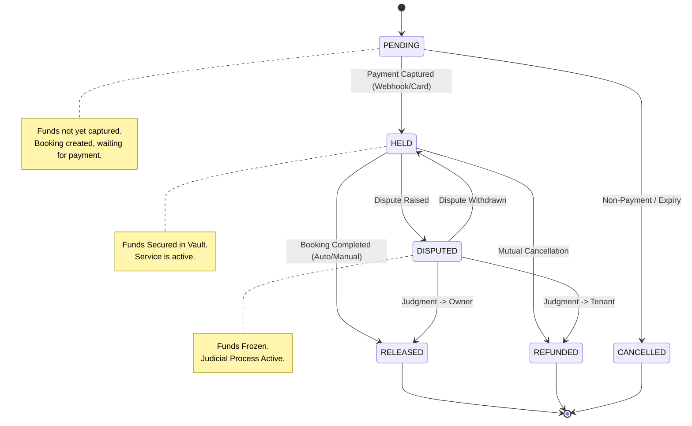

# Escrow Financial Flow
**System:** ReadyRent.Gala Financial Core
**Date:** 2026-02-15
**Model:** Binary Resolution (Strict)

## 1. State Diagram
The **EscrowEngine** enforces a strict unidirectional flow for terminal states.

## 2. Binary Resolution Model
The system operates on a **Binary Resolution Model** for Phase 3.5. This means every locked amount must be fully resolved to exactly one party.

### The Axioms
1.  **Conservation of Value:** `Input Amount == Output Amount`.
2.  **Binary Outcome:**
    -   **RELEASED:** 100% of funds go to the **Owner** (minus fees).
    -   **REFUNDED:** 100% of funds return to the **Tenant**.
3.  **No Split Verdicts:** The engine does *not* support partial refunds in this version. Any "split" decision by a judge must be executed as a full release + separate compensation transaction, or requires the Phase 4 Split Ledger upgrade.

## 3. Transaction Map
Every state transition produces a specific `WalletTransaction` or Audit Event.

| Transition | Action | Financial Effect |
| :--- | :--- | :--- |
| `PENDING` → `HELD` | **Deposit** | Tenant Wallet Debit 📉 -> Vault Credit 📈 |
| `HELD` → `RELEASED` | **Payout** | Vault Debit 📉 -> Owner Wallet Credit 📈 |
| `HELD` → `REFUNDED` | **Refund** | Vault Debit 📉 -> Tenant Wallet Credit 📈 |
| `HELD` → `DISPUTED` | **Freeze** | No Movement (Flagging only) |
| `DISPUTED` → `RELEASED` | **Judgment** | Vault Debit 📉 -> Owner Wallet Credit 📈 |

## 4. Constraint Enforcement
-   **PostgreSQL:** `select_for_update` prevents simultaneous Payout and Refund.
-   **Engine:** `validate_transition()` prevents transition to `RELEASED` if balance is insufficient.
